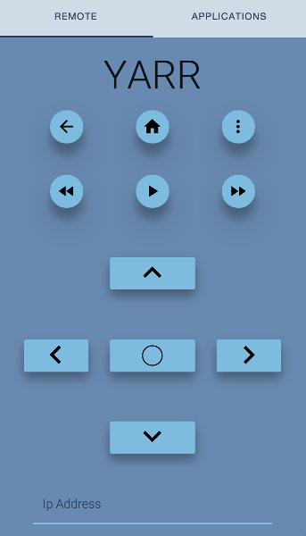

# Roku Remote

Once installed, simply enter the IP address of the Roku device.

### Install with chrome web store (coming soon!)

### Install with source code
* Run "bower install".
* Visit "chrome://extensions" in chrome.
* Enable Developer mode.
* Press "Load unpacked extension".
* Select this folder.
